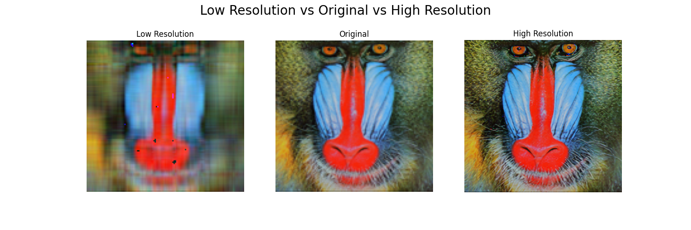

# Image_enhance

## Workflows

1. Update config.yaml
2. Update params.yaml
3. Update the entity in src\Image_enhance\entity\config_entity.py
4. Update the configuration manager in src\Image_enhance\config\configuration.py
5. Update the components in src\Image_enhance\components
6. Update the pipeline in src\Image_enhance\pipeline
7. Update the main.py
8. Update the app.py
## create initial documentation

To create mkdocs run:
```bash
mkdocs new .
```

## Generate requiremnets

```bash
pip freeze > requirements.txt
```
## Prerequisites
Before running the FastAPI API and client examples, make sure you have the following installed:

Python (version >= 3.6)

### Installation

Clone the Repository:

```bash
git clone https://github.com/almazagit1002/Image_enhance.git
```
Navigate to the Project Directory:

```bash
cd Image_enhance
```
## Set Up Python Virtual Environment (Optional but Recommended):

```bash
python3 -m venv venv
.\venv\Scripts\activate
```

## Install Dependencies:

```bash
pip install -r requirements.txt
```

## System Summary

The Image Enhancement System is a software application designed to enhance and reduce the quality of images using a pre-trained deep learning model. It offers functionalities for image preprocessing, model inference, and high and low resolutiuon image generation. It can be used to generate pair images of poor and high quality for training models to produce high quality images from low quality. The system is built with modularity, flexibility, and ease of use in mind, allowing users to enhance images with minimal effort.

## Use Case

* In the "Loading Image Stage" the system performs the initial step of loading the input images for enhancement. This stage involves reading the image files from their specified paths and preparing them for further processing. Additionaly it perfoms a PCA to reduce the quelity of the image and obtain a copy of the original with poor quality. The LoadImagePipeline class is responsible for orchestrating this stage, which includes tasks such as downloading images from URLs, saving them to local storage, and ensuring they are in the correct format for subsequent processing steps. Once this stage is completed, the images are ready to undergo enhancement using the deep residual network.

* The "Enhance Deep Residual Network Stage" focuses on enhancing the quality of the loaded images using a pre-trained deep residual network (DRN) model. This stage utilizes the EDRNPipeline class to facilitate the enhancement process. The primary objective here is to leverage the power of the DRN model to infer high-resolution details from the low-resolution input images. The model performs intricate computations and transformations on the input images to generate high-quality, enhanced versions. Once the enhancement process is finished, the system moves on to the next stage for comparison and analysis.

* In the "Plot Comparison Stage," the system generates visual comparisons between the original and enhanced images to evaluate the effectiveness of the enhancement process. The PlotComparisonPipeline class manages this stage by creating side-by-side visualizations of the low quality, original and enhanced images. These plots provide users with a clear visual representation of the improvements made to the images and help assess the quality of the enhancement results. After this stage, users can review the comparison plots to determine the success of the image enhancement process.

## Example
Image obtained from:
```bash
https://user-images.githubusercontent.com/12981474/40157448-eff91f06-5953-11e8-9a37-f6b5693fa03f.png
``` 
if the user wants to use a different image, modify the url in:

```bash
 Image_enhance\config\config.yaml
```

## Results
Using 6 PCA components and the previously mentioned image the results are the following:


## Docker

### Build Docker Image


Use the following command to build the Docker image for the Pinecone Pipeline:
```bash
docker build -t Image_enhancer .
```
This command will build the Docker image using the provided Dockerfile (Dockerfile) in the current directory (.). The -t flag is used to tag the image with the name Image_enhancer for easy reference.

### Run Docker Container
This command starts a new Docker container named blog_upload from the Image_enhancer Docker image. The --name flag is used to specify a custom name for the container. The container will execute the command specified in the Dockerfile (CMD ["python3", "main.py"]), which in this case runs the main.py script of the Image Enhancer Pipeline.

Once the Docker image is built, you can run a Docker container from it using the following command:
```bash
docker run --name enhancement-pipeline Image_enhancer
```
Feel free to adjust the container name or image tag as needed. Ensure that you have Docker installed and properly configured on your system before running these commands.

## Documentation

To run in local host run:

```bash
mkdocs serve 
```