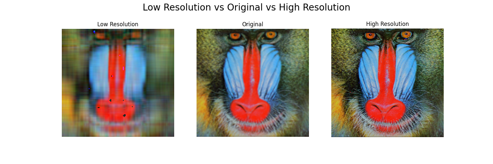

# Image Enhancer

The Image Enhancement System is a software application designed to enhance and reduce the quality of images using a pre-trained deep learning model and PCA. It offers functionalities for image preprocessing, model inference, and high and low resolutiuon image generation. It can be used to generate pair images of poor and high quality for training models to produce high quality images from low quality. The system is built with modularity, flexibility, and ease of use in mind, allowing users to enhance images with minimal effort.


## Project layout

    config/
        config.yml    # The configuration file.
    params.yaml       # TF model to enhance image and PCA components
    src/
        Image_enhance/
            entity/
                config_entity.py 
            config/
                configuration.py
            components/
                load_image.py 
                EDRN.py 
                plot_comparison.py 
            pipeline/
                LoadImagePipeline.py 
                EDRN_Pipeline.py
                PlotComparisonPipeline.py
            constants/
                __init__.py
            utils/
                common.py # common functions
            __init__.py # logger sut up 
    main.py
    setup.py  # creates metadata for setup
    template.py # crteates code template
    Dockerfile
    research/  
        load_image.ipynb 
        Enhanced Deep Residual Networks for single-image super-resolution.ipynb
        Plot_comparison.ipynb

## main

### Update PCA Components
This function takes a user input to reduce or increase the PCA components for image degradation.
```py
def update_pca_components(params_file_path):
    try:
        with open(params_file_path, 'r') as yaml_file:
            data = yaml.safe_load(yaml_file)

        new_pca_components = input("Enter new value for PCA_COMPONENTS: ")
        data['PCA']['PCA_COMPONENTS'] = int(new_pca_components)

        with open(params_file_path, 'w') as yaml_file:
            yaml.dump(data, yaml_file)

        logger.info(f"Updated PCA_COMPONENTS value has been written to {params_file_path}")
    except Exception as e:
        print(f"Error updating PCA_COMPONENTS: {e}")
```

### Execute Pipeline Stages

Execute the 3 pieline stages `LoadImagePipeline()`, `EDRNPipeline()`, `PlotComparisonPipeline()`.

```py
def execute_pipeline_stage(stage_name, pipeline_instance):
    try:
        logger.info(f">>>>>>> stage {stage_name} started <<<<<<<<<<<<")
        pipeline_instance.main()
        logger.info(f">>>>>>> stage {stage_name} completed <<<<<<<<<<<<\n\nx===============x")
    except Exception as e:
        logger.error(f"Error in stage {stage_name}: {e}")
        raise e

```
## Download and Usage
Download from github:
```bash
git clone https://github.com/almazagit1002/Image_enhance.git
``` 
and follow instuctions from the Readme file. 

If the user intends to utilize the code as a foundation for a forthcoming project, forking the repository generates a duplicate under their GitHub account.
### Example

Image obtained from:
```bash
https://user-images.githubusercontent.com/12981474/40157448-eff91f06-5953-11e8-9a37-f6b5693fa03f.png
``` 
if the user wants to use a different image, modify the url in:

```bash
 Image_enhance\config\config.yaml
```

### Results example
Using 6 PCA components. the model [EDRN_model](https://tfhub.dev/captain-pool/esrgan-tf2/1), and the previously mentioned image the results are the following:

